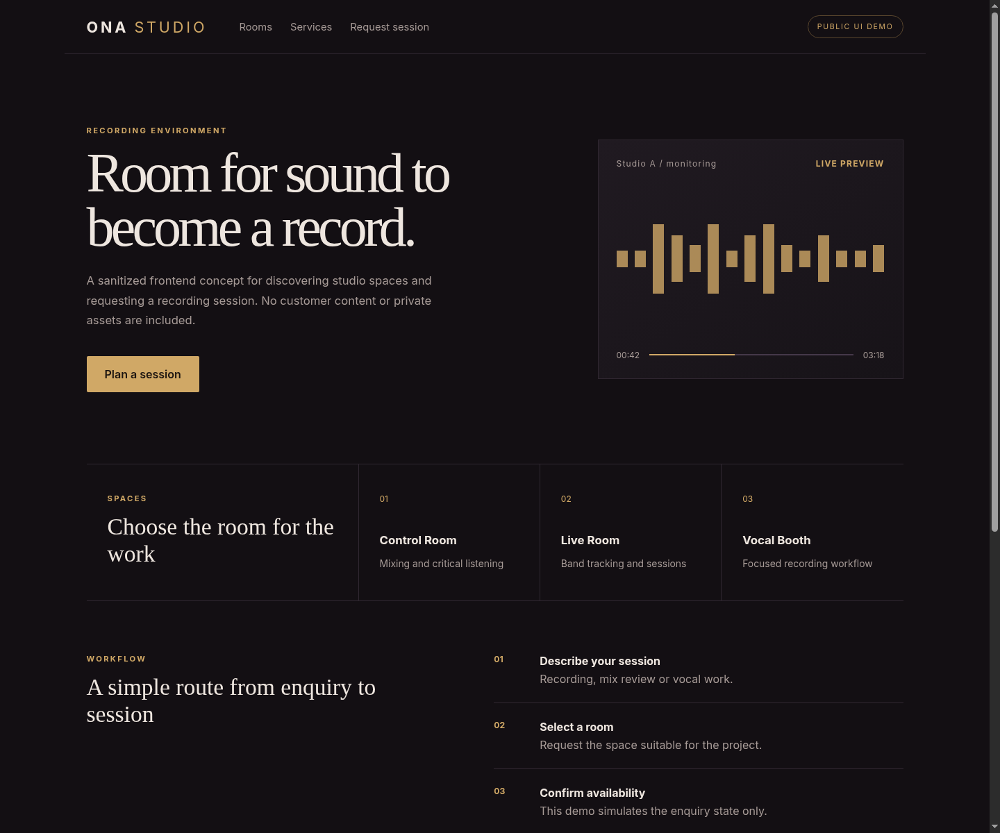

<div align="center">
  
</div>

<div align="center">
  
  
  
</div>

## Public Concept

This repository contains a sanitized frontend concept for a recording studio experience: room discovery, a visual audio motif and a session request interaction. It exists to demonstrate interface design and frontend implementation without publishing the private project's source, assets or customer information.



## What You Can Review

- Responsive single-page layout built with semantic HTML, CSS and JavaScript.
- Clear navigation and call-to-action flow.
- Accessible labelled form interaction with explicit demo-only confirmation.
- A visual system built without private photography or brand assets.

## Run Locally

Open the hosted demo: [https://cmesa-dev.github.io/onastudio/](https://cmesa-dev.github.io/onastudio/)

Open `demo/index.html` in a browser, or serve the folder with any static file server:

```bash
python -m http.server 8080 --directory demo
```

Then open `http://localhost:8080`.

## Verification

```bash
node --check demo/app.js
```

GitHub Actions runs the JavaScript syntax verification on every proposed change.

The repository also contains a GitHub Pages deployment workflow for publishing the static demo from `demo/`.

## Scope Boundary

| Included publicly | Not included |
|---|---|
| Sanitized UI concept and form state interaction | Original frontend implementation |
| Code-only illustrative layout | Private photography, customer names or business data |
| Responsive behavior | Production booking or content services |
